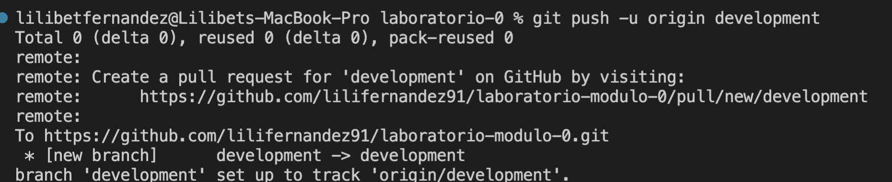

# Laboratorio-Módulo-0

## Pasos a seguir

1. Para crear un repositorio en local:

- Abrir la terminal y navegar hasta el directorio donde deseas crear el repositorio.
- Crear una carpeta con el nombre del repositorio.

> mkdir nombredelrepositorio

- Inicializar el repositorio

> git init

- Abrir la carpeta en Visual Studio Code.
- Crear un primer archivo (En este caso fue el archivo *readme-md*)
- Ejecutar los siguientes comandos:

> git add .

> git commit -m "mensaje"

***

2. Subir el repositorio a GitHub.

- Crear un repositorio en GitHub.
- Ejecutar en la terminal de Visual Studio Code los comandos para conectar el repositorio local con el repositorio de GitHub:

> git remote add origin urldelrepositoriodegithub

> git push origin main

- Verificar que la conexión se haya establecido correctamente con el comando:

> git remote -v

***

3. Commit y push

- Como anteriormente ya se había creado un archivo llamado *readme.md* lo que se hizo fue agregar el contenido de este archivo y actualizar los cambios.
 

- Refrescamos el repositorio de GitHub y comprobamos si se actualizaron los cambios.

***

4. Crear una rama

- Se ejecuta el siguiente comando para crear una nueva rama:

> git checkout -b new-branch

- Y para renombrar la rama pues la nombramos mal ejecutamos:

> git branch --move new-branch development

 
- Subimos la rama rama development a GitHub con el comando: 

> git push -u origin development

- Subimos los cambios a GitHub.

***

5. Merge

- Vuelvo a la rama main.
- Hago merge de la rama development a main.
- Si hay conflicto los soluciono, si no hay conflictos los cambios de la rama development de incorporan a la rama main.
- Hago push de los cambios al repositorio de GitHub.

